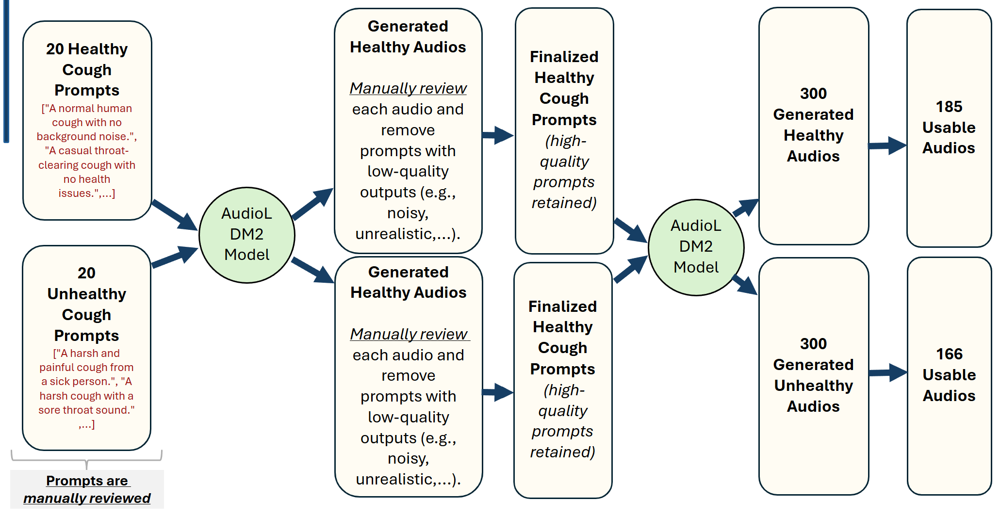
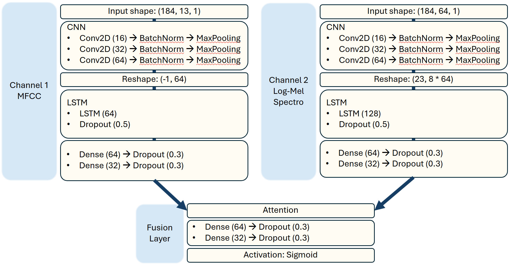
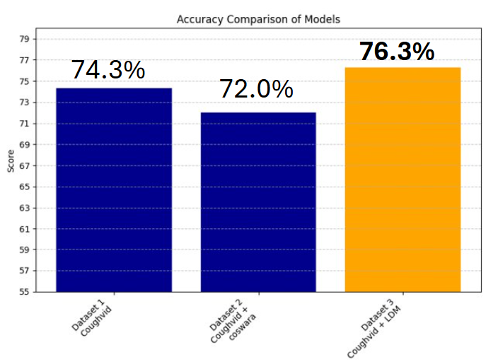
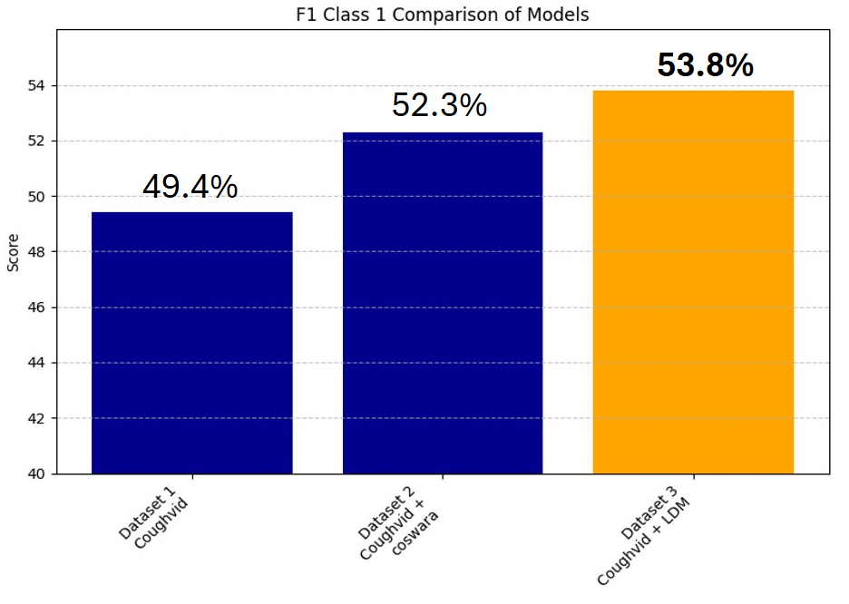

# Audio-Based Respiratory Disease Detection Using Cough Sounds

## Overview
This project focuses on the detection of respiratory diseases through cough audio classification, addressing the challenge of limited labeled medical data. The primary objective is to accurately differentiate between healthy and unhealthy individuals based on audio features extracted from cough recordings.

## Problem Statement
Respiratory diseases continue to pose significant global health challenges. Accurate, scalable, and non-invasive diagnostic solutions are necessary for effective disease management. Traditional diagnostic methods often require extensive resources and medical expertise, underscoring the value of an audio-based machine learning (ML) solution.

## Proposed Solution
We developed an ML pipeline to classify cough sounds as either healthy or unhealthy. Given data scarcity, our approach includes synthetic data augmentation using the Audio Latent Diffusion Model (AudioLDM2) to enhance model performance and stability.

## Datasets
- **Coughvid Dataset** (Orlandic et al., 2021)
- **Coswara Dataset** (Bhattacharya et al., 2020)

## Project Structure
```
Dual-Channel Audio Fusion Network/
├── meta/
├── py_util/              # Helper functions for data preprocessing
├── 1_coughvid_data_preparation.ipynb
├── 2_coswara_data_preparation.ipynb
├── 3_combined_coughvid_coswara_data_preparation.ipynb
├── 4_ldm_data_preparation.ipynb
├── 5_CoughVid_training.ipynb
├── 6_combined_data_training(coswara).ipynb
├── 7_combined_data_training(coswara_fusion).ipynb
├── 8_LDM_audio_generation.ipynb
└── 9_IDM_training.ipynb
```

## Data Preprocessing
- Load & filter audio (duration ≥ 0.1s)
- Resample audio to 12kHz
- Remove audio with Signal-to-Noise Ratio (SNR) < 10 dB
- Denoise and trim silence from audio files
- Compute features: Mel-Frequency Cepstral Coefficients (MFCC) & Log-Mel Spectrogram

## Data Expansion & Augmentation
To address data scarcity:
- Expanded the dataset by approximately 15% using real cough samples (Coswara)
- Augmented dataset with synthetic cough audio generated by AudioLDM2

The figure below illustrates the synthetic data generation workflow using AudioLDM2:


## Model Architecture
A Dual-channel CNN-LSTM architecture leveraging:
- **MFCC features** (Channel 1)
- **Log-Mel Spectrogram features** (Channel 2)
- Fusion via attention mechanisms and fully connected layers

The overall structure of the dual-channel fusion model is shown below:


## Performance Summary
- Baseline CNN (MFCC): Accuracy = 0.78, Healthy F1 = 0.10, Unhealthy F1 = 0.87
- Expanded dataset model: Improved Healthy F1 to 0.51
- Synthetic data model (LDM): Best improvements, demonstrating the effectiveness of synthetic augmentation
**Accuracy comparison across baseline, expanded, and augmented datasets:**


**F1 score comparison showing improvements for the 'Healthy' class:**


## Key Insights
- Cough audio is a viable biomarker for respiratory disease detection.
- Data augmentation, particularly synthetic audio, significantly mitigates issues related to limited labeled medical data.
- Feature fusion (MFCC and Log-Mel Spectrogram) enhances model predictive capabilities.

## Future Directions
- Investigate less resource-intensive synthetic data generation methods.
- Extend the classification framework to include multiple respiratory conditions beyond binary healthy/unhealthy classification.

## Authors
- Li Xinjie *(Corresponding Author)*: xinjie.li.2024@mitb.smu.edu.sg 
- Dau Vu Dang Khoi: vdk.dau.2024@mitb.smu.edu.sg
- Samuel Lee Wei Sheng: ws.lee.2024@mitb.smu.edu.sg
- Tan Zong Yin Shawn: shawn.tan.2024@mitb.smu.edu.sg
- Wu Jialu: jialu.wu.2024@mitb.smu.edu.sg


## Acknowledgements

We would like to express our sincere gratitude to **Prof. Dai Bing Tian** (btdai@smu.edu.sg) and **Prof. Yang Xiao Yan** (xyyang@smu.edu.sg) for their invaluable guidance and support throughout the course of this project. Their insights and mentorship greatly contributed to the development and refinement of our work.
